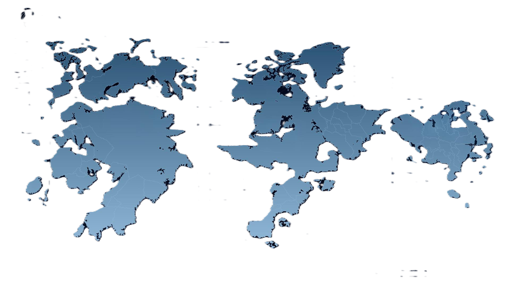

# Strangereal Archive

Fan-made tactical archive for aircraft, squadrons, nations, conflicts, ace pilots, and weapon systems from a Strangereal-inspired universe. The app is built as an interactive HUD-style database with themed visual channels inspired by different Ace Combat eras.

This is an unofficial fan project. It is not affiliated with, endorsed by, or sponsored by Bandai Namco, Project Aces, or the Ace Combat franchise owners.



## Features

- File-based TanStack Start routes for each archive section.
- Catalog pages for aircraft, squadrons, nations, conflicts, ace pilots, and weapon systems.
- Detail pages with related records and tactical stat panels.
- Theme selector with AC7, AC4, AC5, and AC Zero inspired color palettes.
- Responsive HUD interface using Tailwind CSS v4 and shadcn/ui primitives.
- Local static archive data, so the app runs without a backend service.

## Tech Stack

- React 19
- TypeScript
- TanStack Start and TanStack Router
- Vite
- Tailwind CSS v4
- shadcn/ui component structure with Radix UI primitives
- lucide-react icons
- npm with `package-lock.json`

## Getting Started

Requirements:

- Node.js 22.12 or newer
- npm

Install dependencies:

```bash
npm install
```

Run the development server:

```bash
npm run dev
```

Build for production:

```bash
npm run build
```

Preview the production build:

```bash
npm run preview
```

Lint the project:

```bash
npm run lint
```

Format the project:

```bash
npm run format
```

## Routes

| Route            | Purpose                             |
| ---------------- | ----------------------------------- |
| `/`              | Home dashboard and archive overview |
| `/aircraft`      | Aircraft catalog                    |
| `/aircraft/$id`  | Aircraft detail record              |
| `/squadrons`     | Squadron catalog                    |
| `/squadrons/$id` | Squadron detail record              |
| `/nations`       | Nation catalog                      |
| `/nations/$id`   | Nation detail record                |
| `/conflicts`     | Conflict timeline                   |
| `/conflicts/$id` | Conflict detail record              |
| `/aces`          | Ace pilot dossier catalog           |
| `/aces/$id`      | Ace pilot detail record             |
| `/weapons`       | Weapon system catalog               |
| `/weapons/$id`   | Weapon detail record                |
| `/quiz`          | Training quiz placeholder           |

## Project Structure

```txt
public/
  images/                  Static public images
src/
  components/              App-specific shared components
  components/ui/           shadcn/ui primitives
  hooks/                   Shared React hooks
  lib/                     Archive data, theme state, helpers
  routes/                  TanStack file-based routes
  router.tsx               Router factory
  routeTree.gen.ts         Generated TanStack route tree
  server.ts                SSR error wrapper
  start.ts                 TanStack Start configuration
  styles.css               Tailwind CSS v4 theme and global styles
```

## Notes for Contributors

- Do not edit `src/routeTree.gen.ts` by hand. It is generated by TanStack Router.
- Route files live in `src/routes`. Do not add `src/pages` or Next.js-style `app` routes.
- shadcn/ui components live in `src/components/ui`.
- The shared class helper is `cn()` in `src/lib/utils.ts`.
- Global theme tokens and Tailwind CSS directives live in `src/styles.css`.
- Archive content currently lives in `src/lib/archive-data.ts`.
- Static images should go under `public/images` and be referenced with `/images/...`.

## Deployment

`npm run build` creates a production build in `dist/client` and `dist/server`. The project uses TanStack Start, so deploy it to a platform that can run the generated server output or supports Vite/TanStack Start deployments.

For a quick local production check:

```bash
npm run build
npm run preview
```

## License

The project source code is released under the MIT License. Ace Combat names, references, and related trademarks belong to their respective owners. This repository is a non-commercial fan-made archive interface.
